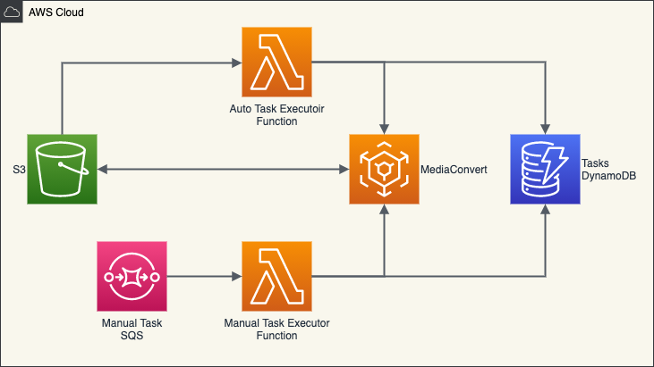

# VideoConverter



## About

VideoConverter is a open to use serverless solution that can convert video in S3 with MediaConvert. The convert job can be executed manual by message from SQS or the S3 event notification. All tasks are stored in DynamoDB and task status will be updated with MediaConvert CloudWatch event.


This project contains source code and supporting files that can deploy with the SAM CLI. It includes the following files and folders.

- video_transfer - Source codes for the application's Lambda function.
- docs - Documents of how to deploy & use.
- samples - Sample file can used for CLI to config your runtime environment.
- template.yaml - A template that defines the application's AWS resources.


The application uses several AWS resources, including Lambda functions, DynamoDB tables and SQS by default.
These resources are defined in the `template.yaml` file in this project, your can as your wish.

## Develop

This application’s codes are using Python3, you can use any favor tools to edit them.

If you prefer to use an integrated development environment (IDE) to build and test your application, you can use the AWS Toolkit. See the following links to get started.

* [CLion](https://docs.aws.amazon.com/toolkit-for-jetbrains/latest/userguide/welcome.html)
* [GoLand](https://docs.aws.amazon.com/toolkit-for-jetbrains/latest/userguide/welcome.html)
* [IntelliJ](https://docs.aws.amazon.com/toolkit-for-jetbrains/latest/userguide/welcome.html)
* [WebStorm](https://docs.aws.amazon.com/toolkit-for-jetbrains/latest/userguide/welcome.html)
* [Rider](https://docs.aws.amazon.com/toolkit-for-jetbrains/latest/userguide/welcome.html)
* [PhpStorm](https://docs.aws.amazon.com/toolkit-for-jetbrains/latest/userguide/welcome.html)
* [PyCharm](https://docs.aws.amazon.com/toolkit-for-jetbrains/latest/userguide/welcome.html)
* [RubyMine](https://docs.aws.amazon.com/toolkit-for-jetbrains/latest/userguide/welcome.html)
* [DataGrip](https://docs.aws.amazon.com/toolkit-for-jetbrains/latest/userguide/welcome.html)
* [VS Code](https://docs.aws.amazon.com/toolkit-for-vscode/latest/userguide/welcome.html)
* [Visual Studio](https://docs.aws.amazon.com/toolkit-for-visual-studio/latest/user-guide/welcome.html)


The resources and codes are list bellow, more details can check the comments in files.

```rst
.
├── template.yml  # The SAM template files, includes all required AWS resources defined.
├── video_converter
│   ├── auto_executor.py   # The lambda function with S3 notification and start a converter job
│   └── manual_executor.py # The lambda function with SQS message and start converter job(s)
│   └── requirement.txt    # The python pip install requirements
│   └── task.py            # The core function to handle task and converter job
│   └── task_event.py      # The lambda function with MediaConvert CloudWatch rule to update task status
│   └── task_params.py     # The json params used to create a MediaConvert job 
```

## Deploy

To deploy this application, you should use the Serverless Application Model Command Line Interface (SAM CLI), SAM CLI is an extension of the AWS CLI that adds functionality for building and testing Lambda applications. 

To use the SAM CLI, you need the following tools.

* AWS CLI - [How to Install](https://docs.aws.amazon.com/zh_cn/cli/latest/userguide/cli-chap-install.html)
* SAM CLI - [How to Install](https://docs.aws.amazon.com/serverless-application-model/latest/developerguide/serverless-sam-cli-install.html)
* Python3.8 (Only for development) - [Download Python](https://www.python.org/downloads/)

> To deploy this application you must have a AKSK with IAM role has full access to Lambda, DynamoDB and SQS.

Before use the SAM CLI, you should setup you aws cli credential first, run the following in your shell:

```bash
aws configure
```

For more information, please see the [AWS CLI document](https://docs.aws.amazon.com/zh_cn/cli/latest/userguide/cli-chap-configure.html).

To deploy your application for the first time, run the following in your shell:

```bash
sam deploy --guided --capabilities CAPABILITY_IAM CAPABILITY_NAMED_IAM
```

The command will package and deploy your application to AWS, with a series of prompts:

* **Stack Name**

  The name of the stack to deploy to CloudFormation. This must be unique to your account and region.

* **AWS Region**

  The AWS region you want to deploy to.

* **Parameter DefaultJobTemplateName**

  The MediaConvert job template name used as default job template. This must in the same account and region, it can be created by your self anytime. 

* **Confirm changes before deploy**

* If set to yes, any change sets will be shown to you before execution for manual review. If set to no, the AWS SAM CLI will automatically deploy application changes.

* **Allow SAM CLI IAM role creation**

  Many AWS SAM templates, including this example, create AWS IAM roles required for the AWS Lambda function(s) included to access AWS services. By default, these are scoped down to minimum required permissions.

* **Save arguments to samconfig.toml**

  If set to yes, your choices will be saved to a configuration file inside the project, so that in the future you can just re-run `sam deploy` without parameters to deploy changes to your application.

## Config

After success deployed, you can config the application by set/update the items in DynamoDB table `video-converter-options`.

The options in table must have two fields, `Key` and `Value`. 

Currently you can set following options use special keys:

* **MediaConvertRole**

* The role created by the application. This is used when create a MediaConvert job.

* **default-JobTemplateName**

  The default MediaConvert job template name used to create converter job. This is used when you not set a converter job template from your task define.

* **default-OutputBucket**

  The default bucket used for MediaConvert job output. This is used when you not set a output for your task.

  To use this option, the `bucket` must exists.
  
* **`bucket`-JobTemplateName**

  The bucket MediaConvert job template name used to create converter job. This is used when the job is auto executed from S3 notification.

  `bucket` must be the same as your S3 bucket name with case sensitive.
  
  If this option not exists, the `default-JobTemplateName` will used as default.
  
* **`bucket`-OutputBucket**

  The bucket used for MediaConvert job output for a special bucket. This is used when the job is auto executed from S3 notification.

  `bucket` must be the same as your S3 bucket name with case sensitive.

  If this option not exists, the `default-OutputBucket` will used as default.

## Run

To make the job auto executed when a new video file put in your S3 bucket, you can simply set a S3 event notification on your bucket. You can do it in your AWS console or use the AWS CLI shell:

```bash
aws s3api put-bucket-notification-configuration --bucket your-bucket-name --notification-configuration file://samples/bucket-notification-config.json
```

> * Please replace the **`THE-ARN-OF-AutomationFunction`** in the config file use the Arn value of the AutomationFunction. You can get the value from the deploy cli outputs or CloudFormation console.
> 
> * Please make sure replace the **`your-bucket-name`** in command to the bucket name you want to auto execute the convert job.
>

For more details to use the configuration file, please see the [AWS CLI Document](https://docs.aws.amazon.com/cli/latest/reference/s3api/put-bucket-notification-configuration.html).


To start a manual job, just send a message to the `VideoConverterSQS`. You can do it in your AWS console or use the AWS CLI shell:

```shell
aws sqs send-message --queue-url the-videoconvertersqs-url --message-body "create task" --message-attributes file://samples/manual-task.json
```

> * Please make sure replace the **`the-videoconvertersqs-url`** in command to your SQS url, you can get it from the stack outputs as `VideoConverterSQS`.
>
> * Please make sure the config json is using the correct options such as bucket name, s3 object key and filter etc.

The attributes in manual-task.json are includes:

* **Bucket**

  The name of bucket which the task’s source video file(s) in. This attribute is *MANDATORY*.

* **Key**

  The single s3 object key of the source video. 

  This attribute is optional, if you don’t use it, just remove the whole entry.

* **Filter**

  The `JMESPath` expression to filter files in the bucket. 

  For example, to filter files with date, the expression can be:

  ​	`Contents[?to_string(LastModified)>='2021-01-01 00:00:00+00:00'][]`

  This attribute is optional, if you don’t use it, just remove the whole entry.

* **Force**

  Force to create task even it is already exists. Default is `false`.

  This attribute value can be `true` or `false`.

>  **ATTENTION**
>
> The lambda functions have default timeout setting, please make sure you never reach the limit. You can check the `template.yaml` to modify them base your requirement.

## Cleanup

To delete the application that you created, use the AWS CLI. Assuming you used your project name for the stack name, you can run the following:

```bash
aws cloudformation delete-stack --stack-name <the-stack-name-your-deployed>
```

> **NOTES**: This command just delete the application stack only, all converted jobs and output files are keep remained! 

## Resources

See the [AWS SAM developer guide](https://docs.aws.amazon.com/serverless-application-model/latest/developerguide/what-is-sam.html) for an introduction to SAM specification, the SAM CLI, and serverless application concepts.

Next, you can use AWS Serverless Application Repository to deploy ready to use Apps that go beyond this application and learn how authors developed their applications: [AWS Serverless Application Repository main page](https://aws.amazon.com/serverless/serverlessrepo/)

## Todo

- [ ] Use Athena & QuickInsight to display task reports
